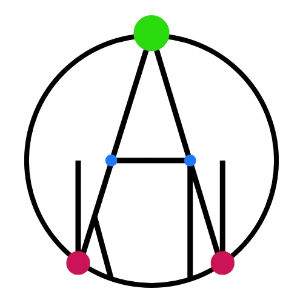

<!-- logo in the center -->

# Awesome OIKAN Projects

A curated list of awesome projects built with [OIKAN](https://github.com/silvermete0r/oikan), a powerful framework for interpretable machine learning.

The best projects from this repository will be featured in the [OIKAN's Featured Projects Website](https://silvermete0r.github.io/oikan/projects.html).

**🔗 OIKAN repository:** [silvermete0r/oikan](https://github.com/silvermete0r/oikan)

&nbsp;
&nbsp;
&nbsp;

## Contributing

We welcome contributions to this list! If you have an awesome OIKAN project to share, please follow these steps:
1. **Fork the repository**: Click the "Fork" button at the top right of this page.
2. **Clone your fork**: Use `git clone https://github.com/silvermete0r/awesome-oikan.git` to clone your fork locally.
3. **Add your project**: Open the `README.md` file and add your project to the appropriate section.
4. **Submit a pull request**: Once you've made your changes, submit a pull request to the main repository.
5. **Follow the guidelines**: Please ensure your project follows the [contribution guidelines](CONTRIBUTING.md).

## Projects

### Classification

| Project Name | Description | Link | Author |
|--------------|-------------|------|--------|
| Classification Tutorial using Iris Dataset | A tutorial on classification using the Iris dataset with OIKAN. | [GitHub Jupyter Notebook](https://github.com/silvermete0r/oikan/blob/main/examples/classification_tutorial.py) | @silvermete0r |
| Drug Classification (AC: 0.97) | A classification model for drug classification using OIKAN. | [Kaggle Notebook](https://www.kaggle.com/code/armanzhalgasbayev/oikan-v0-0-3-drug-classification-ac-0-97) | @silvermete0r |
| OIKAN ~ Interpretable ML for CMI 2025 - Training | Predicting Body Focused Repetitive Behaviors from a Wrist-Worn Device using OIKAN (Competition: [CMI - Detect Behavior with Sensor Data](https://www.kaggle.com/competitions/cmi-detect-behavior-with-sensor-data)) | [Kaggle Notebook Training](https://www.kaggle.com/code/armanzhalgasbayev/oikan-interpretable-ml-for-cmi-2025-training) & [Kaggle Notebook Submission](https://www.kaggle.com/code/armanzhalgasbayev/oikan-cmi-2025-submission) | @silvermete0r |
| S5E6 - OIKAN Predicting Optimal Fertilizers | Kaggle Playground Season 5, Episode 6: Select the best fertilizer for different weather, soil conditions and crops. Kaggle Competition: [Predicting Optimal Fertilizers](https://www.kaggle.com/competitions/playground-series-s5e6) | [Kaggle Notebook](https://www.kaggle.com/code/armanzhalgasbayev/s5e6-oikan-predicting-optimal-fertilizers) | @silvermete0r |

### Regression

| Project Name | Description | Link | Author |
|--------------|-------------|------|--------|
| Regression Tutorial using California Housing Dataset | A tutorial on regression using the California Housing dataset with OIKAN. | [GitHub Jupyter Notebook](https://github.com/silvermete0r/oikan/blob/main/examples/regression_tutorial.py) | @silvermete0r |

## Acknowledgements

We would like to thank all contributors and the OIKAN community for their support and contributions!