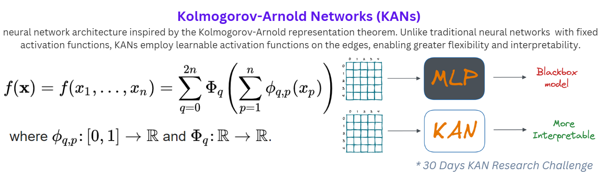
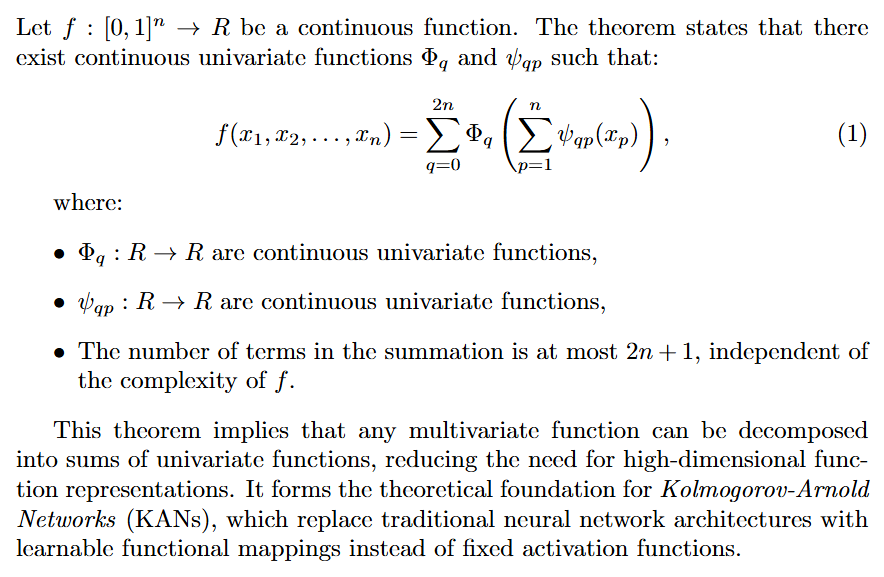
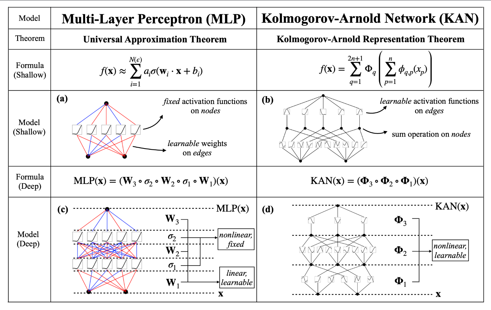
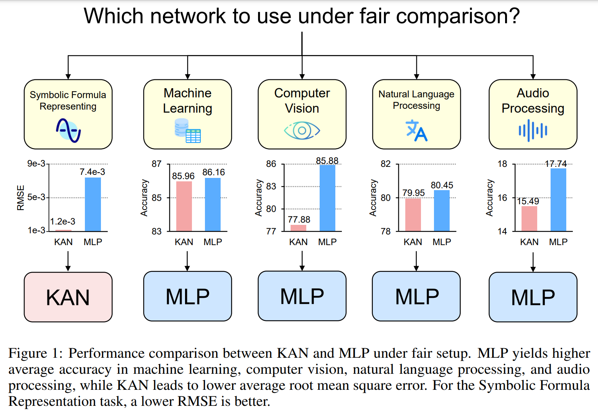
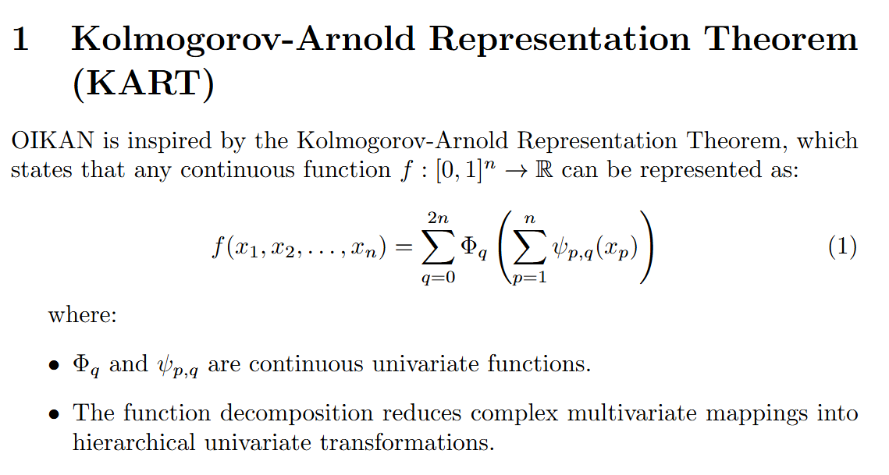
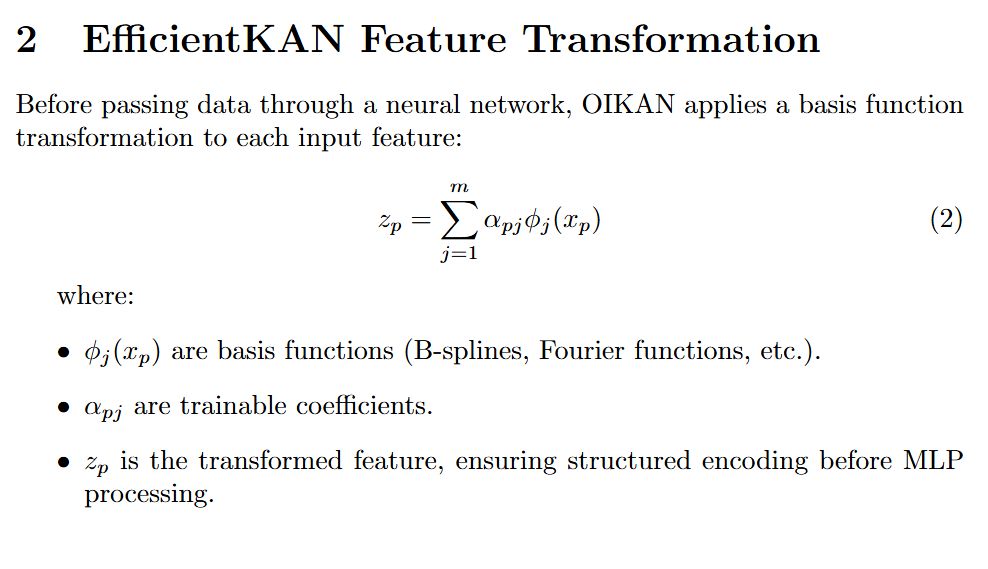
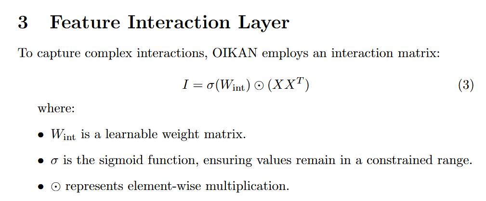
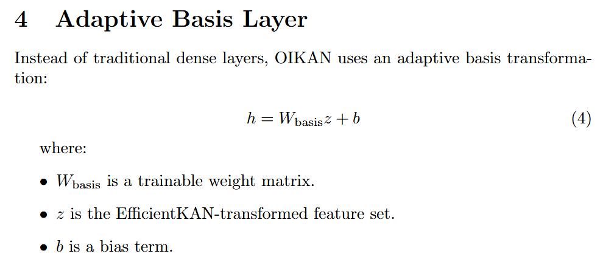
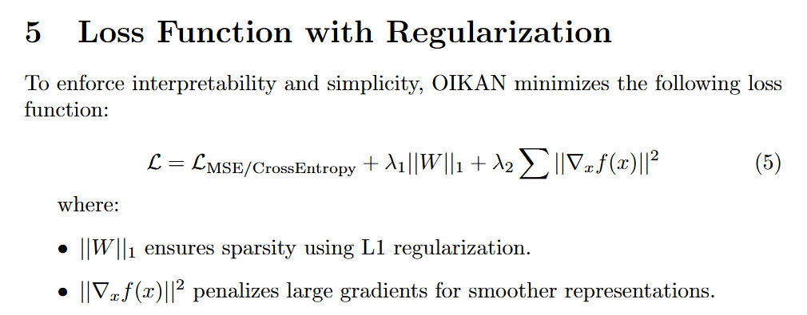

# 30 Days of Kolmogorov Arnold Networks Research

[](https://github.com/silvermete0r/30github)&nbsp;
[](https://github.com/silvermete0r/30github)&nbsp;
[](https://github.com/silvermete0r/30github)&nbsp;

* **Programming Languages:** Python, C++ / C; 
* **Main goal:** Optimize traditional neural networks using the Kolmogorov-Arnold Representation Theorem to achieve more accurate interpretable symbolic representations with better performance.

* **Tasks:**
  * **Study:** Understand the theoretical foundations of the Kolmogorov-Arnold Representation Theorem and the KAN algorithm.
  * **Implement:** Develop the KAN algorithm in Python or C++/C.
  * **Optimize:** Enhance the KAN algorithm for specific applications to maximize performance.
  * **Apply:** Investigate practical applications of the KAN algorithm across various domains in symbolic mathematics, physics, and machine learning.
  * **Visualize:** Create visual tools to represent the KAN algorithm for better comprehension.

* **Duration:** 30 days (1 month)

## Table of Contents
- [Day 0: Intro to Kolmogorov Arnold Networks](#day-0-intro-to-kolmogorov-arnold-networks)
- [Day 1: Implementing KAN for Regression Problems in Python](#day-1-implementing-kan-for-regression-problems-in-python)
- [Day 2: Implementing KAN for Classification Problems in Python](#day-2-implementing-kan-for-classification-problems-in-python)
- [Day 3: Kolmogorov–Arnold-Informed neural network: A physics-informed deep learning framework for solving PDEs based on Kolmogorov–Arnold Networks](#day-3-kolmogorovarnold-informed-neural-network-a-physicsinformed-deep-learning-framework-for-solving-pdes-based-on-kolmogorovarnold-networks)
- [Day 4: Trying KAN for Physics ~ Lagrangian Mechanics](#day-4-trying-kan-for-physics--lagrangian-mechanics)
- [Day 5: Get started working on OIKAN (Development of a Python library for KAN combined with MLP)](#day-5-get-started-working-on-oikan-development-of-a-python-library-for-kan-combined-with-mlp)
- [Day 6: Mathematical Foundation and Architecture of OIKAN](#day-6-mathematical-foundation-and-architecture-of-oikan)
- [Day 7: Symbolic Formula Extraction Development for Regression](#day-7-symbolic-formula-extraction-development-for-regression)
- [Day 8: Symbolic Formula Extraction Development for Classification](#day-8-symbolic-formula-extraction-development-for-classification)
- [Day 9: Model Interpretability and Visualization in OIKAN: `plot_symbolic_formula()` for regression & classification models](#day-9-model-interpretability-and-visualization-in-oikan-plot_symbolic_formula-for-regression--classification-models)
- [Day 10: LaTeX Symbolic Formula Extractor Function in OIKAN](#day-10-latex-symbolic-formula-extractor-function-in-oikan)
- [Day 11: Working on Documentation of the Project](#day-11-working-on-documentation-of-the-project)
- [Day 12: 3D visualization of Symbolic formulas in OIKAN for function approximation](#day-12-3d-visualization-of-symbolic-formulas-in-oikan-for-function-approximation)
- [Contributing to the OIKAN Library](#contributing-to-the-oikan-library)
- [References](#references)

## Day 0: Intro to Kolmogorov Arnold Networks

### Introduction

Kolmogorov-Arnold Networks (KANs) are a recent innovation in neural network architecture, drawing upon the Kolmogorov-Arnold representation theorem. This theorem, developed by [Andrey Kolmogorov](https://en.wikipedia.org/wiki/Andrey_Kolmogorov) and [Vladimir Arnold](https://en.wikipedia.org/wiki/Vladimir_Arnold), demonstrates that any continuous multivariable function can be expressed through the superposition of a finite number of univariate functions. KANs replace the fixed linear weights of traditional neural networks with learnable univariate functions, enhancing flexibility and interpretability.

### Historical Context

The Kolmogorov-Arnold theorem, introduced by Andrey Kolmogorov in 1957, revolutionized the representation of continuous multivariable functions by breaking them down into simpler univariate functions. Vladimir Arnold further validated and extended Kolmogorov's work in 1958, proving its effectiveness in representing higher-dimensional functions1. Their work provided new methods for machine learning, data fitting, and solving partial differential equations1.

### Mathematical Formulation



### How KANs Work

KANs use the Kolmogorov-Arnold Representation (KAR) theorem alongside [B-splines](https://en.wikipedia.org/wiki/B-spline) to create a dynamic model. The KAR theorem decomposes complex functions into simpler ones, and KANs apply this principle to each edge within the network, making each edge a learnable B-spline activation function. During training, each B-spline adjusts its control points through backpropagation, refining its approach to data with each iteration and continuously improving accuracy and efficiency.

### How B-Splines Work

B-splines are piecewise polynomial functions that are smooth at the joints, making them ideal for approximating complex functions. They are defined by a set of control points that determine the shape of the curve. By adjusting these control points, the B-spline can adapt to various data patterns, providing a flexible and powerful tool for function approximation.

### Comparison with Traditional Neural Networks (MLPs)



*🔗 Source: [(Arxiv) KAN: Kolmogorov–Arnold Networks](https://arxiv.org/abs/2404.19756)*



*🔗 Source: [(Arxiv) KAN or MLP: A Farier Comparison](https://arxiv.org/abs/2407.16674)*

### PyKAN Library Python

The PyKAN library provides a Python implementation of the KAN algorithm, allowing users to create, train, and evaluate KAN models. The library simplifies the process of working with KANs, providing a user-friendly interface for researchers and developers. PyKAN enables users to harness the power of KANs for various applications, from data fitting to machine learning tasks.

## Day 1: Implementing KAN for Regression Problems in Python

[PyKAN Library Python](https://github.com/KindXiaoming/pykan)

Today, we'll explore how to implement a KAN model in Python using the PyKAN library for the Housing Prices Prediction Competition on Kaggle.

**1.1. Installation:**

```bash
pip install pykan
```

**1.2. Initializing a KAN:**

```python
from kan import *

model = KAN(width=[X_train.shape[1], 20, 10, 1], grid=3, k=3, seed=42, device='cpu')
```

**Explanation of parameters:**

* `width=[X_train.shape[1], 20, 10, 1]`: Defines a network with input features, two hidden layers (20 and 10 neurons), and one output.
* `grid=3`: Sets the number of grid points for piecewise function representation.
* `k=3`: Defines the order of the spline function.
* `seed=42`: Ensures reproducibility.
* `device='cpu'`: Uses CPU for training (set 'cuda' if using a GPU).

**1.3. Training the KAN:**

```python
train_data = {
    'train_input': torch.tensor(X_train, dtype=torch.float64),
    'train_label': torch.tensor(y_train, dtype=torch.float64).view(-1, 1),
    'test_input': torch.tensor(X_val, dtype=torch.float64),
    'test_label': torch.tensor(y_val, dtype=torch.float64).view(-1, 1)
}

model.fit(train_data, opt="LBFGS", steps=100, lamb=0.001)
```

**Explanation of training parameters:**

* `opt="LBFGS"`: Uses the Limited-memory Broyden-Fletcher-Goldfarb-Shanno (L-BFGS) optimizer. Why? It's efficient for small datasets.
* `steps=100`: Sets the number of optimization steps.
* `lamb=0.001`: Defines the regularization parameter.

**1.4. Extracting Symbolic Formula**

*A key advantage of KAN is that it allows us to obtain a symbolic representation of the trained model. We can either manually set functions or let PyKAN automatically discover symbolic expressions.*

**1.4.1 Manual Mode**

```python
model.fix_symbolic(0, 0, 0, 'sin')  # First layer, first neuron, first function -> sin
model.fix_symbolic(0, 1, 0, 'x^2')  # First layer, second neuron, first function -> x^2
model.fix_symbolic(1, 0, 0, 'exp')  # Second layer, first neuron, first function -> exp
```

**1.4.2 Automatic Mode**

***PyKAN automatically choose the best-fitting symbolic functions from a predefined library***

```python
library = ['x', 'x^2', 'x^3', 'x^4', 'exp', 'log', 'sqrt', 'tanh', 'sin', 'abs']
model.auto_symbolic(lib=library)
```

**1.4.3. Printing Final Mathematical Representation of KAN model**

```python
from kan.utils import ex_round
final_formula = ex_round(model.symbolic_formula()[0][0], 4)
print("Final Model Formula:", final_formula)
```

**1.5. Visualizing the Trained KAN Model**

*Visualizing math formula as a network graph.*

```python
model.plot()
```

**1.6. Making Predictions**

```python
test_preds = model(torch.tensor(test_data, dtype=torch.float64)).cpu().detach().numpy()
```

**1.7. Predictions Submission**

```python
submission = pd.DataFrame({'Id': test_ids, 'SalePrice': test_preds.flatten()})
submission.to_csv('submission.csv', index=False)
```

*KAN offers interpretable models with a strong mathematical foundation, making it a unique alternative to traditional deep learning architectures. Tomorrow, we'll explore hyperparameter tuning and advanced visualization techniques. 🚀*

My implementation of PyKAN model for the Regression Problem: ["Housing Prices"](https://www.kaggle.com/competitions/home-data-for-ml-course) Kaggle Competition: [notebooks/pykan-housing-prices-prediction.ipynb](notebooks/pykan-housing-prices-prediction.ipynb)

## Day 2: Implementing KAN for Classification Problems in Python

Today, we'll explore how to implement a KAN model in Python using the PyKAN library for the Titanic Survival Prediction Competition on Kaggle.

My implementation of PyKAN model for the Binary Classification Problem: ["Titanic - Machine Learning from Disaster"](https://www.kaggle.com/competitions/titanic) Kaggle Competition: [notebooks/titanic-pykan-predictions.ipynb](notebooks/titanic-pykan-predictions.ipynb)

## Day 3: Kolmogorov–Arnold-Informed neural network: A physics-informed deep learning framework for solving PDEs based on Kolmogorov–Arnold Networks

Today, we'll explore how to implement a Kolmogorov–Arnold-Informed neural network (KAINN) for solving partial differential equations (PDEs) based on Kolmogorov–Arnold Networks.

* The paper introduces the Kolmogorov–Arnold-Informed Neural Network (KINN), a physics‐informed deep learning framework that uses Kolmogorov–Arnold Networks (KANs) instead of conventional multilayer perceptrons (MLPs). KANs are noted for their improved interpretability and require fewer parameters than standard MLPs.
* Unlike traditional approaches that rely on a single formulation, the framework considers various PDE formulations (strong form, energy form, inverse form). Although mathematically equivalent, these forms lead to different computational behaviors, and KINN is designed to effectively handle these variations.
* Extensive numerical experiments—including multi-scale problems, singularities, stress concentration, nonlinear hyperelasticity, and heterogeneous materials—demonstrate that KINN achieves higher accuracy and faster convergence compared to traditional PINNs based on MLPs. An exception was noted in some complex geometry problems where performance gains were less pronounced.
* The framework builds on the Kolmogorov–Arnold representation theorem, which provides a theoretical foundation for the KAN architecture, thereby justifying its efficiency and reliability in approximating solutions to PDEs.
* The proposed method not only demonstrates significant improvements in solving forward and inverse PDE problems in computational solid mechanics but also comes with open-source code, ensuring that the results are reproducible and can serve as a valuable resource for further research in scientific computing.

**Practice Link:** *[Example 6: Solving Partial Differential Equation (PDE)](https://kindxiaoming.github.io/pykan/Example/Example_6_PDE_interpretation.html)*

**🔗 Source:** [Kolmogorov Arnold Informed neural network: A physics-informed deep learning framework for solving PDEs based on Kolmogorov Arnold Networks](https://arxiv.org/abs/2406.11045v1)


## Day 4: Trying KAN for Physics ~ Lagrangian Mechanics

Today, we'll explore how to implement a KAN model in Python for solving physics problems, specifically in the domain of Lagrangian Mechanics.

PyKAN can be used to approximate and simplify a complex physical formula like the Lagrangian Simple Pendulum Formula in physics. The goal is to express it in terms of simpler symbolic functions while preserving its essential behavior.


**Practice Link:** *[Trying KAN for Physics: Lab 1 - Lagrangian](https://www.kaggle.com/code/armanzhalgasbayev/trying-kan-for-physics-lab-1-lagrangian/)*

**Results:**


| Metric                | Value     |
|-----------------------|-----------|
| Mean Squared Error (MSE) | 1.426959 |
| Mean Absolute Error (MAE) | 1.041068 |
| R² Score              | 0.883975  |
| 👍 Good Fit           | The model performs well but can be improved. |

## Day 5: Get started working on OIKAN (Development of a Python library for KAN combined with MLP)

OIKAN (Optimized Implementation of Kolmogorov-Arnold Networks) is a PyTorch-based library for creating interpretable neural networks. It implements the KAN architecture to provide both accurate predictions and interpretable results.

**🔗 Link:** [OIKAN Github Repository](https://github.com/silvermete0r/oikan)

**🔗 Released OIKAN as a PyPi library:** [oikan 0.0.1.2](https://pypi.org/project/oikan/0.0.1.2/)

**🔗 Comparison PyKAN vs. OIKAN vs. MLPClassifier ~ Classification Battle:** [Kaggle Notebook](notebooks/titanic-pykan-vs-mlp-vs-oikan.ipynb)

## Day 6: Mathematical Foundation and Architecture of OIKAN

### Mathematical Foundation of OIKAN











### OIKAN Model Architecture


## Day 7: Symbolic Formula Extraction Development for Regression

Today, we'll focus on developing a symbolic formula extraction module for regression problems in OIKAN. The goal is to extract interpretable symbolic formulas from trained OIKAN models to enhance model transparency and understanding.

## Day 8: Symbolic Formula Extraction Development for Classification

Today, we'll focus on developing a symbolic formula extraction module for classification problems in OIKAN. The goal is to extract interpretable symbolic formulas from trained OIKAN models to enhance model transparency and understanding.

## Day 9: Model Interpretability and Visualization in OIKAN: `plot_symbolic_formula()` for regression & classification models

Today, we'll work on enhancing model interpretability and visualization in OIKAN by developing a `plot_symbolic_formula()` function. This function will generate visual representations of the symbolic formulas extracted from trained OIKAN models for regression and classification tasks.

## Day 10: LaTeX Symbolic Formula Extractor Function in OIKAN

Today, we'll develop a LaTeX symbolic formula extractor function in OIKAN. The function will convert the symbolic formulas extracted from trained OIKAN models into LaTeX format for better presentation and readability.

# Day 11: Working on Documentation of the Project

Today, we'll focus on documenting the OIKAN project to provide clear instructions, examples, and explanations for users. The documentation will cover installation, usage, features, and more to help users understand and utilize the OIKAN library effectively.

# Day 12: 3D visualization of Symbolic formulas in OIKAN for function approximation

Today, we'll explore 3D visualization of symbolic formulas in OIKAN for function approximation. The goal is to create interactive visualizations that showcase the symbolic formulas extracted from trained OIKAN models in a 3D space, providing a unique perspective on the model's interpretability and performance.

## Contributing to the OIKAN Library

If you're interested in contributing to the OIKAN library, feel free to check out the [Github repository](https://github.com/silvermete0r/oikan)

## References

1. [(Arxiv) KAN: Kolmogorov–Arnold Networks](https://arxiv.org/abs/2404.19756)
2. [(Arxiv) KAN 2.0: Kolmogorov-Arnold Networks Meet Science](https://arxiv.org/abs/2408.10205)
3. [(Arxiv) KAN or MLP: A Farier Comparison](https://arxiv.org/abs/2407.16674)
4. [(Arxiv) DropKAN: Regularizing KANs by masking post-activations](https://arxiv.org/abs/2407.13044)
5. [(Arxiv) DropKAN: Dropout Kolmogorov-Arnold Networks](https://arxiv.org/abs/2407.13044v3)
6. [(Arxiv) Rethinking the Function of Neurons in KANs](https://arxiv.org/abs/2407.20667)
7. [(Github) PyKAN Library Python](https://github.com/KindXiaoming/pykan)
8. [(Article)The Math Behind KAN – Kolmogorov-Arnold Networks](https://towardsdatascience.com/the-math-behind-kan-kolmogorov-arnold-networks-7c12a164ba95/)
9. [(Github) Awesome KAN(Kolmogorov-Arnold Network)](https://github.com/mintisan/awesome-kan)
10. [(Datacamp Tutorial) Kolmogorov-Arnold Networks (KANs): A Guide With Implementation](https://www.datacamp.com/tutorial/kolmogorov-arnold-networks)
11. [(Arxiv) Kolmogorov Arnold Informed neural network: A physics-informed deep learning framework for solving PDEs based on Kolmogorov Arnold Networks](https://arxiv.org/abs/2406.11045v1)
12. [(Arxiv) BSRBF-KAN: A combination of B-splines and Radial Basis Functions in Kolmogorov-Arnold Networks](https://arxiv.org/abs/2406.11173v1)
13. [(Arxiv) MLP-KAN: Unifying Deep Representation and Function Learning](https://arxiv.org/abs/2410.03027v1)
14. [(Github) An Efficient Implementation of Kolmogorov-Arnold Network](https://github.com/Blealtan/efficient-kan)